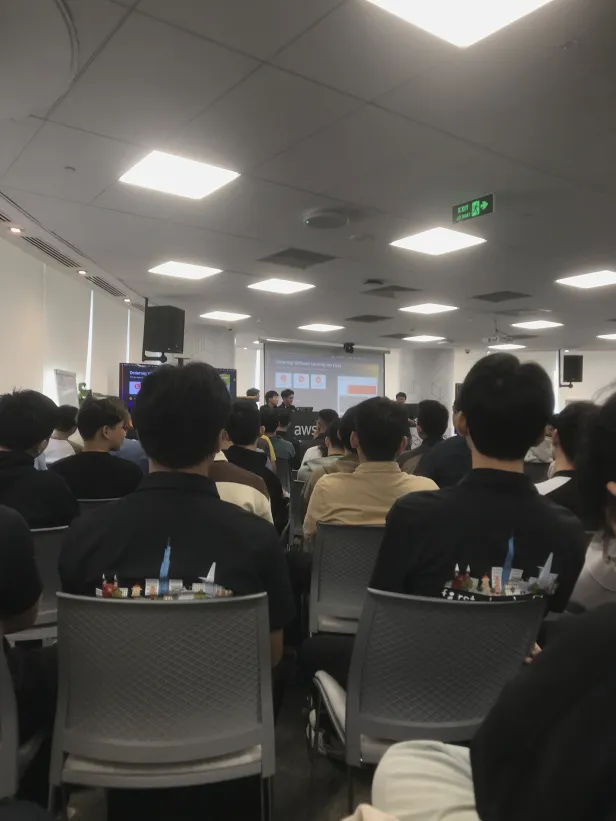

# Bài thu hoạch “Định hướng nghề nghiệp & Kiến trúc AWS”

### Mục Đích Của Sự Kiện

Buổi Meetup được tổ chức nhằm mang đến cho người tham dự cái nhìn thực tế về môi trường làm việc trong lĩnh vực Cloud Computing, DevOps và Data Analytics. Thông qua những chia sẻ từ các kỹ sư và chuyên gia đang làm việc tại doanh nghiệp, chương trình giúp người tham dự hiểu rõ hơn về định hướng nghề nghiệp, các kỹ năng cần thiết cũng như cách áp dụng kiến thức AWS vào các dự án thực tế.

Thông qua sự kiện, ban tổ chức hướng tới các mục tiêu sau:

- **Định hướng nghề nghiệp:** Giúp sinh viên và người mới bắt đầu hiểu rõ các vị trí như Cloud Engineer, DevOps Engineer và Data Analytics Engineer.
- **Chia sẻ kinh nghiệm thực tế:** Giới thiệu môi trường làm việc, quy trình phát triển sản phẩm và những kỹ năng cần có khi làm việc trong doanh nghiệp.
- **Nâng cao kiến thức AWS:** Minh họa cách thiết kế và triển khai hệ thống trên nền tảng AWS thông qua các ví dụ thực tế.

### Nội Dung Nổi Bật

#### Văn hóa làm việc trong doanh nghiệp

Các diễn giả chia sẻ kinh nghiệm làm việc trong môi trường đa quốc gia, cách phối hợp giữa các nhóm kỹ thuật và kỹ năng giao tiếp trong quá trình phát triển sản phẩm. Ngoài kiến thức chuyên môn, khả năng làm việc nhóm và tinh thần học hỏi liên tục được đánh giá là những yếu tố quan trọng để phát triển lâu dài.

#### Định hướng nghề nghiệp Data Analytics Engineer

Phần trình bày giới thiệu vai trò của Data Analytics Engineer trong doanh nghiệp, các công việc thường gặp như thu thập, xử lý và phân tích dữ liệu để hỗ trợ ra quyết định. Bên cạnh đó, diễn giả cũng chia sẻ lộ trình học tập và những công cụ phổ biến trong lĩnh vực phân tích dữ liệu.

#### DevOps Engineer và quy trình triển khai hệ thống

Buổi chia sẻ giúp người tham dự hiểu rõ hơn về vai trò của DevOps Engineer trong việc tự động hóa quy trình triển khai, giám sát hệ thống và kết nối giữa đội ngũ phát triển với đội ngũ vận hành. Diễn giả cũng giới thiệu một số công cụ và quy trình thường được sử dụng trong thực tế.

#### Hành trình phát triển cùng AWS

Diễn giả chia sẻ quá trình học tập, tham gia cộng đồng First Cloud AI Journey và từng bước phát triển để làm việc với các dự án AWS thực tế. Những kinh nghiệm về học tập, thực hành và chinh phục các chứng chỉ AWS mang lại nhiều định hướng hữu ích cho người mới bắt đầu.

#### Thiết kế hệ thống URL Shortener trên AWS

Một nội dung nổi bật của buổi Meetup là phần trình bày về kiến trúc hệ thống rút gọn URL trên AWS. Diễn giả phân tích cách sử dụng các dịch vụ như AWS CloudFront, AWS WAF và AWS Amplify để xây dựng hệ thống có khả năng mở rộng, đảm bảo hiệu năng và tăng cường bảo mật cho ứng dụng.

### Những Gì Học Được

#### Định hướng nghề nghiệp

Buổi Meetup giúp em hiểu rõ hơn về vai trò của Cloud Engineer, DevOps Engineer và Data Analytics Engineer trong doanh nghiệp. Qua đó, em có thêm cơ sở để định hướng lộ trình học tập và phát triển bản thân trong lĩnh vực Cloud Computing.

#### Kỹ năng làm việc

Bên cạnh kiến thức chuyên môn, em nhận thấy tư duy phản biện, kỹ năng giao tiếp và khả năng làm việc nhóm là những yếu tố quan trọng để phối hợp hiệu quả trong môi trường làm việc thực tế.

#### Kiến thức về AWS

Thông qua ví dụ xây dựng hệ thống URL Shortener trên AWS, em hiểu thêm cách kết hợp các dịch vụ AWS để xây dựng một hệ thống có khả năng mở rộng, đảm bảo hiệu năng và tăng cường bảo mật.

### Ứng Dụng Vào Công Việc

- **Định hướng việc học:** Xây dựng kế hoạch học tập rõ ràng hơn về AWS, Cloud Computing và các kỹ năng cần thiết để chuẩn bị cho công việc sau này.
- **Áp dụng kiến thức AWS:** Tham khảo cách thiết kế kiến trúc hệ thống trên AWS để vận dụng vào các bài tập và dự án cá nhân.
- **Rèn luyện kỹ năng mềm:** Chú trọng hơn đến kỹ năng giao tiếp, làm việc nhóm và giải quyết vấn đề trong quá trình học tập và thực hiện các dự án.

### Trải nghiệm trong event

Tham gia buổi FCAJ Meetup giúp em có cơ hội lắng nghe những chia sẻ thực tế từ các kỹ sư đang làm việc trong lĩnh vực Cloud Computing và DevOps. Qua những câu chuyện về quá trình học tập, làm việc và phát triển nghề nghiệp, em hiểu rõ hơn những kỹ năng mà doanh nghiệp đang tìm kiếm cũng như các cơ hội trong lĩnh vực này.

Đặc biệt, phần chia sẻ về kiến trúc hệ thống URL Shortener trên AWS giúp em có cái nhìn trực quan hơn về cách các dịch vụ AWS được kết hợp để xây dựng một hệ thống thực tế. Bên cạnh đó, những kinh nghiệm về tư duy phản biện, giao tiếp và làm việc nhóm cũng là những bài học hữu ích mà em có thể áp dụng trong quá trình học tập và thực hiện các dự án sau này.

#### Một số hình ảnh khi tham gia sự kiện

