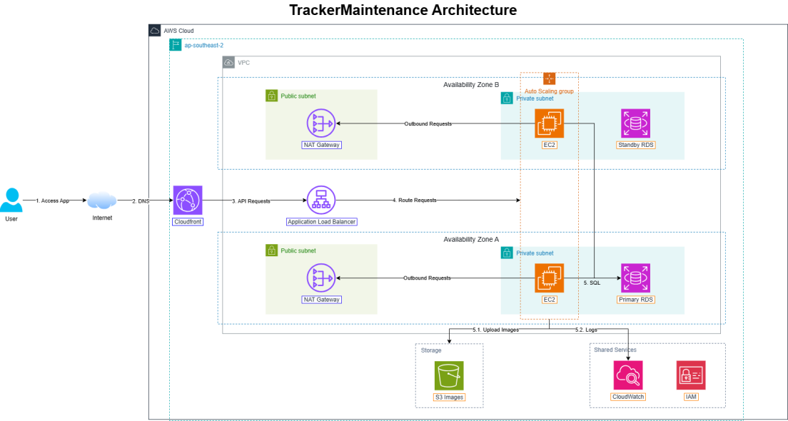

<div style="text-align: center; margin: 20px 0;">



  <div style="font-weight: bold; margin-top: 8px; color: #555;">Figure 1. Overall architecture of the network infrastructure and AWS service integration for the Tracker Maintenance project.</div>
</div>

<br>

## 1. Project Overview

**Tracker Maintenance System** is a full-stack cloud-native web application designed to manage, track, and maintain industrial equipment throughout its lifecycle. The system enables organizations to digitize their entire equipment maintenance workflow — from reporting equipment faults and assigning technicians to scheduling periodic maintenance, uploading photo evidence, and generating reports — all through a unified, role-based web platform.

The project was developed and deployed entirely on **Amazon Web Services (AWS)** as part of the internship program under **Đề tài 3: Xây dựng và phát triển ứng dụng Web trên nền tảng Cloud** (Application Development on Cloud Platform).

## 2. Business Problem Statement

In traditional industrial and facility management environments, equipment maintenance is typically managed through paper-based logs, spreadsheets, or disconnected on-premises software. These approaches suffer from several key limitations:

- **Lack of real-time visibility:** Managers cannot instantly track which equipment is broken, which technician is assigned, or the current repair progress without making phone calls or checking physical logs.
- **No centralized fault reporting:** Regular employees (Reporters) have no structured channel to submit equipment failure reports — they typically send messages via informal communication channels.
- **No audit trail for maintenance work:** There is no photographic or timestamped evidence of completed maintenance tasks, making it impossible to verify work quality or trace historical issues.
- **Inefficient scheduling:** Periodic preventive maintenance scheduling is done manually, leading to missed or duplicated work orders.
- **Security vulnerabilities:** Simple web login systems are vulnerable to brute-force password attacks, putting sensitive equipment and operational data at risk.

The **Tracker Maintenance System** resolves all of the above problems by providing a cloud-hosted, role-based web platform with real-time notifications, QR code asset tracking, S3 photo storage, and built-in brute-force login protection.

## 3. System Goals

The workshop covers the following core technical objectives:

1. **Full-Stack Web Application Development:** Build a production-ready web application with a Spring Boot 3.5 (Java 21) REST API backend and a ReactJS (React Router v7, TypeScript, TailwindCSS) frontend.
2. **Cloud Infrastructure Deployment on AWS:** Deploy the entire application on AWS services including EC2, RDS PostgreSQL, S3, ECR, CloudWatch, IAM, and CloudFront.
3. **Containerization with Docker:** Package both frontend and backend services as Docker containers using multi-stage builds, and orchestrate them with Docker Compose on an EC2 instance.
4. **Authentication Security — Brute-Force Protection:** Implement an in-memory rate-limiting and account lockout system to protect the login endpoint against automated credential-stuffing and brute-force attacks.
5. **CI/CD Pipeline Automation:** Set up a GitHub Actions workflow that automatically builds, pushes Docker images to Amazon ECR, and deploys them to the EC2 server on every push to the `main` branch.
6. **Real-Time Notifications:** Implement WebSocket-based (SockJS + STOMP) push notifications to alert users in real time when maintenance tickets are created, updated, or assigned.
7. **QR Code Asset Tracking:** Auto-generate QR codes for each registered equipment item, enabling technicians to scan a QR code and instantly access full equipment details and maintenance history.
8. **Cloud Media Storage (Amazon S3):** Store all uploaded images (equipment photos, maintenance evidence) in Amazon S3, completely offloading storage from the EC2 instance.
9. **Centralized Logging with CloudWatch:** Stream all application container logs (backend and frontend) to AWS CloudWatch Log Groups for centralized, searchable, real-time monitoring.
10. **ECR Cross-Region Replication:** Configure Amazon ECR registry replication rules so that Docker images pushed to the primary Sydney region are automatically synchronized to secondary regions (Singapore, Ohio), enabling future multi-region deployment.

## 4. Architecture Overview

The system follows a **multi-tier, cloud-native architecture** deployed inside the AWS `ap-southeast-2 (Sydney)` region:

```
User (Browser)
    │
    ▼
Internet
    │
    ▼
Amazon CloudFront (CDN & Global Edge / SSL Termination)
    │
    ▼
Internet Gateway (VPC Entry Point)
    │
    ▼
┌─────────────────── VPC (ap-southeast-2) ──────────────────┐
│  ┌────── Public Subnet ──────┐  ┌──── Private Subnet ────┐ │
│  │                           │  │                        │ │
│  │  EC2 Instance             │  │  Amazon RDS            │ │
│  │  ├─ Docker: tracker-fe    │◄─┤  PostgreSQL            │ │
│  │  │  (React Router/Node.js)│  │  (db.t4g.micro)        │ │
│  │  └─ Docker: tracker-be    │  │                        │ │
│  │     (Spring Boot API)     │  └────────────────────────┘ │
│  └───────────┬───────────────┘                             │
│              │ Upload Images          Logs                  │
│              ▼                         ▼                   │
│  ┌── Amazon S3 ──┐       ┌── CloudWatch Logs ──┐          │
│  │  Images Bucket │       │  /tracker-maint/be  │          │
│  │  (Public Read) │       │  /tracker-maint/fe  │          │
│  └───────────────┘       └─────────────────────┘          │
│                                                             │
│  ┌── IAM ────────────────────────────────────────────┐    │
│  │  EC2 Role, GitHub Actions User, S3 Access Keys    │    │
│  └───────────────────────────────────────────────────┘    │
└────────────────────────────────────────────────────────────┘

Amazon ECR (ap-southeast-2)
  ├─ tracker-be:latest
  └─ tracker-fe:latest
       │ Cross-Region Replication
       ├──► ECR ap-southeast-1 (Singapore)
       └──► ECR us-east-2 (Ohio)

GitHub Actions CI/CD Pipeline
  push to main ──► Build Docker ──► Push to ECR Sydney ──► SSH Deploy EC2
```

## 5. Technology Stack Summary

| Layer              | Technology               | Version    | Purpose                                            |
| ------------------ | ------------------------ | ---------- | -------------------------------------------------- |
| Frontend Framework | React Router             | v7 (SSR)   | Single Page Application with Server-Side Rendering |
| Frontend Language  | TypeScript               | 5.x        | Type-safe frontend development                     |
| Frontend Styling   | TailwindCSS              | v3         | Utility-first responsive CSS                       |
| Backend Framework  | Spring Boot              | 3.5        | REST API server                                    |
| Backend Language   | Java                     | 21 (LTS)   | Backend business logic                             |
| Backend Security   | Spring Security + JWT    | 6.x        | Authentication & authorization                     |
| Database           | PostgreSQL               | 15         | Relational database                                |
| Container Runtime  | Docker + Docker Compose  | 24.x       | Application containerization                       |
| Container Registry | Amazon ECR               | -          | Private Docker image registry                      |
| Compute            | Amazon EC2               | t2.micro   | Cloud virtual server                               |
| Database Service   | Amazon RDS               | PostgreSQL | Managed cloud database                             |
| Object Storage     | Amazon S3                | -          | Image and media file storage                       |
| CDN                | Amazon CloudFront        | -          | Global content delivery & SSL                      |
| Logging            | Amazon CloudWatch        | -          | Centralized log management                         |
| Identity           | AWS IAM                  | -          | Permissions and access control                     |
| DNS                | Route 53 + dpdns.org     | -          | Domain name system                                 |
| CI/CD              | GitHub Actions           | -          | Automated build and deployment                     |
| Real-time          | WebSocket (SockJS/STOMP) | -          | Push notification system                           |
| Code Repository    | GitHub                   | -          | Source code version control                        |
